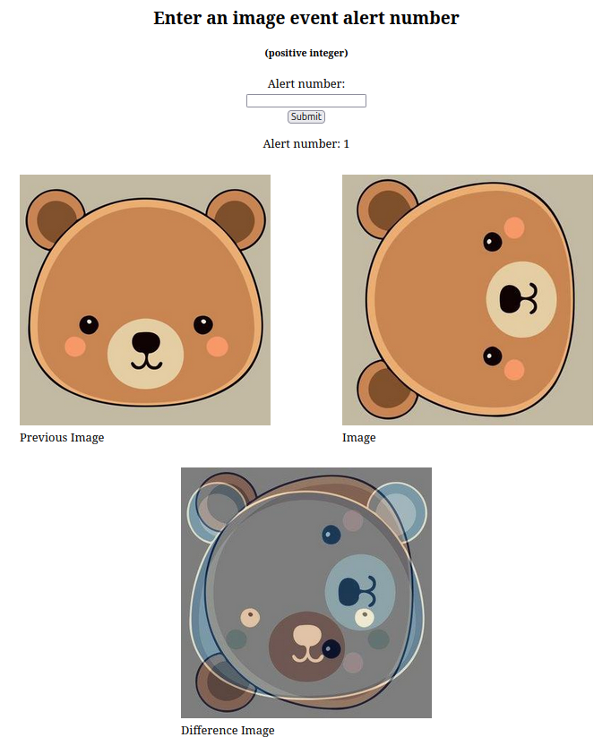

# Amazon Cloud Mock Image Pipeline Using Apache Kafka

### This project's main purpose is to familiarize myself with Apache Kafka, an open-source, distributed event streaming platform. My application is designed to run on Amazon Cloud and utilize Amazon Cloud's RDS MySQL relational database and S3 object storage services. The application's Apache Kafka clients are written in Python, and its standalone webpage is done using Flask, which provides server-side web programming using Python.

-----------------------------------------------------------------------

#### Description

This project's mock image processing pipeline mimics what the image processing pipeline will be for the Nancy Grace Roman Space Telescope.

You can look at a visualization of the pipeline in the [development_docs/](development_docs/) subdirectory. This directory also includes a To Do list, a description of the relational database schema, etc.

The mock image pipeline receives images, stores their metadata in a relational database table, stores the images themselves in object storage, analyzes these images to detect an image event of interest, stores the image event metadata in a relational database table, stores the image event analysis-produced derivative images in object storage, and alerts subscribed parties about image events, storing records of these image event alerts in a relational database table.

There is also a standalone (non-Apache Kafka) image event viewer webpage. The user enters an image event alert number to see the images associated with the image event. See the end of this document.

The mock aspects of the image pipeline are:  

- The images are not received from an external source. They are generated by the Kafka image receiving client, starting with the original image of a computer-drawn cute teddy bear head that is stored in the *image_original/* subdirectory.

  

  

- After several of the exact same images in the image stream are "received" by the image receiving client, the most recently received image is changed by rotating it by 90 degrees. This changed image is used as the next image to be received in the image stream. This results in the Kafka image analysis client detecting an image event of interest: "current image is different than the previous image."

- No astronomical image analysis techniques are used

- There is no image event subscription implementation

- No image event alerts are actually sent

#### Preliminaries

You will need to create your own Amazon Cloud EC2 computing instance, Amazon RDS MySQL endpoint (i.e., database instance; you could but you don't have to create a second Amazon EC2 computing instance for this), Amazon S3 object storage bucket, and various IAM security roles/credentials/settings and other security credentials/policies/settings. There is a lot of WWW info about this on the Internet.

Some useful Python utilities that I created are in the *database_utility_scripts/* and *object_storage_utility_scripts/* subdirectories. They help with interacting with the Amazon Cloud relational database and object storage. They can be run from inside the later-mentioned Apache Kafka container on the Amazon EC2 instance or, if the appropriate python modules are directly installed on the instance (e.g., *mysql-connector-python* and *boto3*), the utilities can be run outside of the Apache Kafka container directly on the instance.

The three Kafka python clients and *image_event_viewer_webpage/app.py* use host, database name, user, password and bucket name settings that are used to interact with the Amazon Cloud relational database and object storage. These settings are in *CLOUD_INFO.py*. You will need to change these.

### Some of the following commands are required to be executed in the application's main directory where its core python files are (e.g., *image_receiving_client.py*). In any event, unless otherwise noted, you should be in this directory before setting up and running all parts of the application,

#### Accessing the Amazon EC2 computing instance

Before each of the setup/execution (on the Amazon EC2 instance) sections below, you will need a new *ssh* session into the Amazon EC2 computing instance. You do this from a local PC, using a new terminal window (e.g., Gnome Terminal) for each *ssh* session. This will allow you to view the separate text outputs of the Apache Kafka broker ("server") and its three pipeline clients when executing. To *ssh* into your Amazon EC2 instance you will need your own Amazon EC2 computing instance public/private key pair (public key stored in a *.pem* file on your local PC; don't lose it!) and the instance's public DNS (or public IPv4 address). These addresses can be found on the Amazon Cloud EC2 console webpage. The below suggested command assumes that you have placed the mock image pipeline application (including all of its subirectories) in the instance's *~/cloud-mock-image-pipeline* subdirectory (e.g., using *scp*). Your instance's public dns or public IPv4 address will be different from the one that the below commands are using. Also, these addresses can change if you stop and start the instance.

Open a new terminal window on your local PC:

$ ssh -i /home/patrick/Desktop/holding/caltech/MockImagePipeline.pem ubuntu@ec2-35-94-18-229.us-west-2.compute.amazonaws.com -t "cd ~/cloud-mock-image-pipeline; exec $SHELL -i" 

Before running the mock image pipeline, create the Amazon RDS MySQL relational database tables using a Python utility that I created. 

$ python3 database_utility_scripts/create_pipeline_database.py

Be careful. If the database has already been created and has tables and data in it, the tables will be recreated and the data lost.

-----------------------------------------------------------------------

If this is not the first time you are running the mock image pipeline on your Amazon EC2 computing instance, you may need to empty the Amazon Cloud relational database tables and object storage.

Enter the following commands:

$ python3 database_utility_scripts/empty_database_tables.py

$ python3 object_storage_utility_scripts/empty_object_storage.py

#### Build an Apache Kafka Docker image and create/run a Docker container that automatically executes Apache Kafka

Open a new terminal window and *ssh* to the EC2 computing instance.

If you have run the mock image pipeline before you may need to clean out previous docker images/containers:

$ docker rm pipeline_container  
$ docker rmi pipeline_image:latest

To build/run the Docker image/container and automatically run Apache Kafka:

$ docker build -t pipeline_image .  
$ docker run --rm -v .:/pipeline --name pipeline_container -u="root" -p 9092:9092 pipeline_image

Wait until the text output is done before moving onto the next section.

Note: that the *docker run* *--rm* argument causes the container to be automatically removed once it is exited via terminating Apache Kafka with a Ctrl-C.

#### Enter the Apache Kafka container and run the Kafka image event alert client

Open a new terminal window and *ssh* to the EC2 computing instance. Enter the following commands:  

$ docker exec -it pipeline_container /bin/bash  
(you will automatically be put in the  /pipeline directory of the container)  

$ python3 image_event_alert_client.py

#### Enter the Apache Kafka container and run the Kafka image analysis client

Open a new terminal window and *ssh* to the EC2 computing instance. Enter the following commands:  

$ docker exec -it pipeline_container /bin/bash  
(you will automatically be put in the  /pipeline directory of the container)  

$ python3 image_analysis_client.py

#### Enter the Apache Kafka container and run the image receiving Kafka client

Open a new terminal window and *ssh* to the EC2 computing instance. Enter the following commands:  

$ docker exec -it pipeline_container /bin/bash
(you will automatically be put in the /pipeline directory of the container)  

$ python3 image_receiving_client.py

-----------------------------------------------------------------------

### If everything executes successfully (according to the text output of each Kafka client), you can further verify successful execution by examining the contents of the application's Amazon Cloud RDS MySQL relational database and S3 object storage. This can be done with the Python relational database and object storage utilities I created:

$ python3 database_utility_scripts/show_database_contents.py  

$ python3 object_storage_utility_scripts/show_object_storage_keys.py  

-----------------------------------------------------------------------

### Image Event Viewer Webpage

There is a standalone (i.e., doesn't rely directly on Apache Kafka) image event viewer webpage available that allows a user to enter an image event alert number to view the images associated with the image event.  

While the mock image pipeline is not required to be currently running, it is required to have completed successfully the last time the pipeline was run. This results in having its relational database and object storage properly and fully populated with image, image event and image event alert data.

The webpage was created with the Flask web development framework, which allows using server-side Python scripting to dynamically create the webpages. 

Open a new terminal window and *ssh* to your Amazon EC2 instance. You will build/run the image/container that will automatically run Flask's development web server. Enter the following commands:

$ cd image_event_viewer_webpage  
$ ./set_up_flask_container.sh  

At the end of successfully setting up the Flask development web server, the webpage's URL will be displayed. For example:

>  Image event viewer webpage URL: http://54.188.16.159    (URL will be different for you)

Ctrl-Left-click on the URL to open the webpage in your web browser. If this doesn't work, you can copy and paste the URL into the web browser's address field.

Enter 1 or 2 for the image event alert number. You can also try entering invalid entries.

